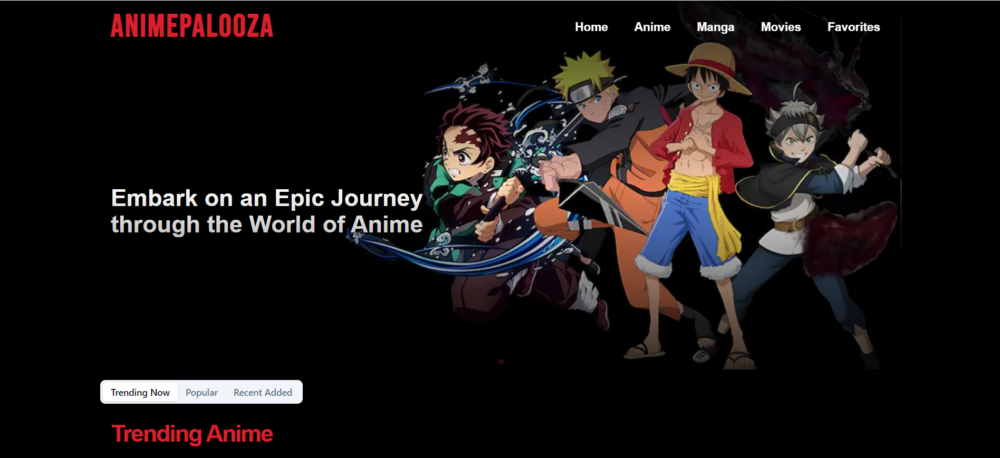
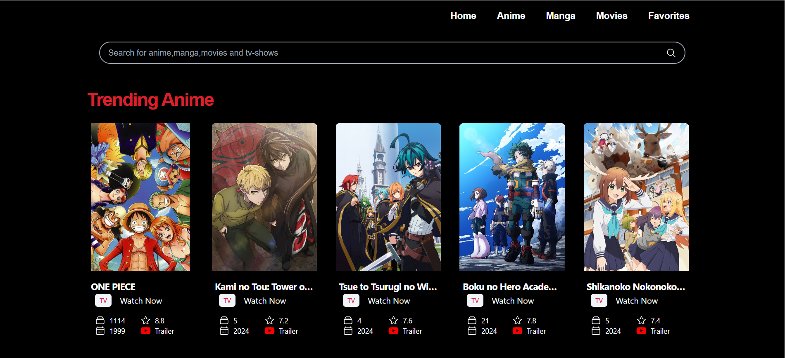
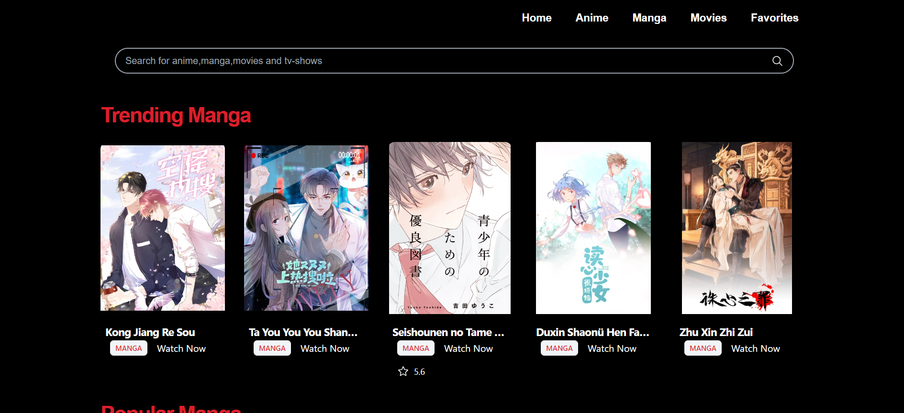
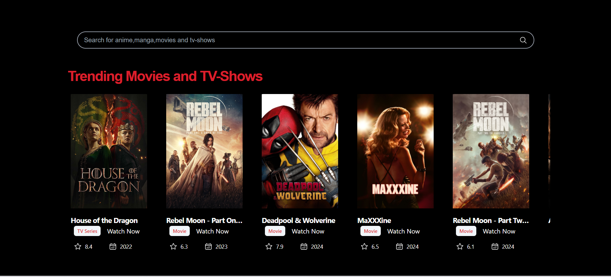
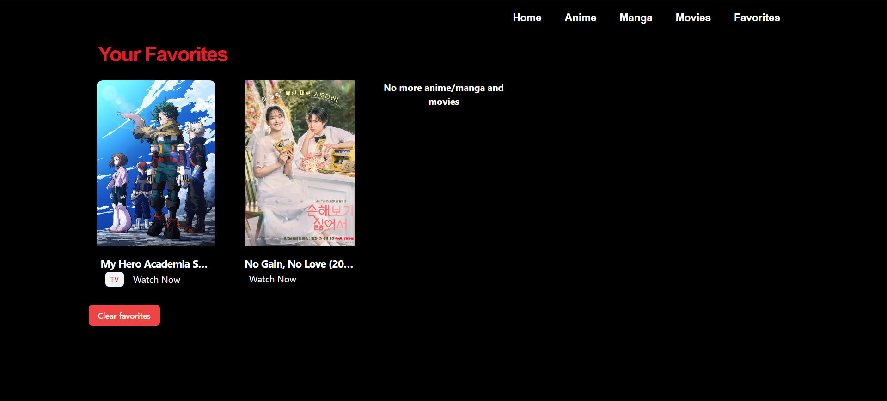

<h1 align="center"> AnimePalooza </h1>

**AnimePalooza** is your ultimate destination for streaming the latest in anime, movies, TV shows, dramas, and manga. Built with Next.js, it offers a seamless and user-friendly experience, allowing enthusiasts to explore, track, and enjoy a vast collection of content across various genres and formats. Developed using [Next.js](https://nextjs.org/), it provides a seamless, user-friendly experience and is optimized as a Progressive Web App (PWA), allowing enthusiasts to explore, track, and enjoy a vast collection of content across various genres and formats from any device.

## Features

- **Stream Your Favorites**: Watch the latest anime, movies, and TV shows with ease.
- **Read the Latest Manga**: Stay updated with new manga releases.
- **Advanced Search**: Find specific content quickly with our intuitive search functionality.
- **Personalized Favorites**: Mark content as favorites to create a custom list for easy access.
- **Responsive Design**: Optimized for both desktop and mobile devices to ensure a smooth browsing experience.
- **Dynamic Content Loading**: Leverages Next.js's dynamic routing and suspense features for efficient content loading and rendering.

## Technologies Used

- **Next.js**: For server-side rendering and static site generation, ensuring fast and optimized performance.
- **React**: To build a responsive and interactive user interface with reusable components.
- **Tailwind CSS**: For modern styling and responsive design.
- **React Icons**: To enhance the user interface with intuitive and meaningful icons.
- **Workbox**: Implements service worker and caching strategies to enable Progressive Web App (PWA) capabilities.

### Screenshots

  

    <h3>Home</h3>
    
  

  

    <h3>Anime Section</h3>
    
  

  

    <h3>Manga Section</h3>
    
  

  

    <h3>Movies Section</h3>
    
  

  

    <h3>Favorites Section</h3>
    
  

